# FirmwareUpdate_RF

> **TR:** Bu depo, masaüstü bir yükleyici arayüzü, UART-RF köprüsü olarak çalışan bir STM32 gönderici ve uzaktaki hedef cihaz üzerinde çalışan RF bootloader'ı tek zincirde birleştiren kablosuz firmware güncelleme sistemini içerir.
>
> **EN:** This repository contains a complete wireless firmware-update chain that combines a desktop uploader UI, an STM32 sender acting as a UART-to-RF bridge, and an RF bootloader running on the remote target device.

> **Önemli Not / Important Note**
> 
> Embedded master agents tested in this repo: https://github.com/Emirfs/WID 
> 
> Bu README, aktif kaynak kodda tanımlı sabitleri esas alır. Özellikle flash yerleşimi ve protokol sabitleri için referans noktası `alici_cihaz/Core/Inc/rf_bootloader.h` ve `uart_rf_gonderici/Core/Inc/rf_protocol.h` dosyalarıdır.
>
> This README follows the active constants implemented in source code. In particular, the authoritative references for flash layout and protocol constants are `alici_cihaz/Core/Inc/rf_bootloader.h` and `uart_rf_gonderici/Core/Inc/rf_protocol.h`.

           
                  
## İçindekiler / Contents

1. [Proje Özeti / Project Summary](#proje-özeti--project-summary)
2. [Sistem Mimarisi / System Architecture](#sistem-mimarisi--system-architecture)
3. [Temel Özellikler / Key Features](#temel-özellikler--key-features)
4. [Depo Yapısı / Repository Structure](#depo-yapısı--repository-structure)
5. [Uçtan Uca Güncelleme Akışı / End-to-End Update Flow](#uçtan-uca-güncelleme-akışı--end-to-end-update-flow)
6. [Boot Kararı ve Kurtarma / Boot Decision and Recovery](#boot-kararı-ve-kurtarma--boot-decision-and-recovery)
7. [Flash Yerleşimi ve Resume Mekanizması / Flash Layout and Resume Mechanism](#flash-yerleşimi-ve-resume-mekanizması--flash-layout-and-resume-mechanism)
8. [RF Protokolü / RF Protocol](#rf-protokolü--rf-protocol)
9. [Güvenlik Modeli / Security Model](#güvenlik-modeli--security-model)
10. [Koddan Örnekler / Code Examples](#koddan-örnekler--code-examples)
11. [Arayüz Akışı / UI Walkthrough](#arayüz-akışı--ui-walkthrough)
12. [Ekran Görüntüsü Yer Tutucuları / Screenshot Placeholders](#ekran-görüntüsü-yer-tutucuları--screenshot-placeholders)
13. [Kurulum ve Çalıştırma / Setup and Run](#kurulum-ve-çalıştırma--setup-and-run)
14. [Sunum İçin Önerilen Hikâye / Suggested Demo Story](#sunum-için-önerilen-hikâye--suggested-demo-story)
15. [Ek Notlar / Additional Notes](#ek-notlar--additional-notes)

## Proje Özeti / Project Summary

**TR**

Bu proje, fiziksel erişimin zor veya maliyetli olduğu cihazlara uzaktan firmware güncellemesi yapabilmek için tasarlanmış çok katmanlı bir sistemdir. Operatör bilgisayardaki Qt tabanlı masaüstü arayüzünden cihaz seçer, proxy/backend üzerinden kanal bazlı firmware kataloğunu çeker, uygun güncellemeyi seçer, yüklemeyi başlatır ve süreç UART ile bağlı olan RF gateway üzerinden uzaktaki alıcı cihaza aktarılır. Alıcı cihaz üzerinde çalışan bootloader ise gelen veriyi doğrular, çözer, flash belleğe yazar, bütünlüğü kontrol eder ve başarılıysa yeni uygulamayı çalıştırır.

Bu sistemin asıl değeri, yalnızca “kablosuz update” yapması değildir. Aynı zamanda:

- RF paketlerini küçük güvenilir parçalara böler.
- Paket ve firmware seviyesinde CRC doğrulaması yapar.
- Sayfa bazlı resume desteği ile yarım kalan güncellemeleri devam ettirebilir.
- X25519 tabanlı ECDH ile oturum anahtarı türetebilir.
- AES-256-CBC ile firmware bloklarını şifreleyebilir.
- Admin paneli üzerinden cihaz profili, AES anahtarı ve servis ayarlarını yönetebilir.

**EN**

This project is a multi-layer remote firmware-update system designed for devices that are difficult or costly to access physically. The operator selects a device from a Qt-based desktop UI, fetches the firmware catalog through a channel-based proxy/backend, chooses the correct update, starts the transfer, and the data is forwarded through a UART-connected RF gateway to the remote receiver. The bootloader running on the receiver validates, decrypts, writes, verifies, and finally launches the new application.

The real value of this system is not only that it performs “wireless updates”, but that it also:

- splits RF traffic into small reliable chunks,
- performs CRC checks at both packet and firmware level,
- supports page-based resume after interruption,
- can derive a session key through X25519 ECDH,
- encrypts firmware blocks with AES-256-CBC,
- and provides an admin panel for device profiles, AES key handling, and service configuration.

## Sistem Mimarisi / System Architecture

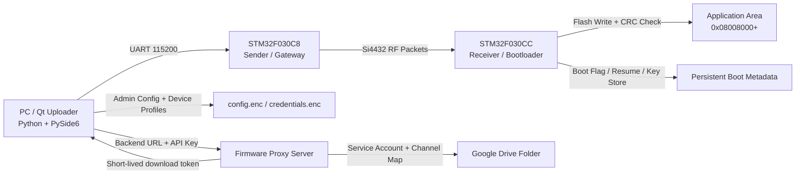

### Bileşenler / Components

| Katman / Layer | Klasör / Folder | Teknoloji / Tech | Rol / Responsibility |
| --- | --- | --- | --- |
| Operatör arayüzü / Operator UI | `Uploader/` | Python, PySide6 | Cihaz seçimi, firmware seçimi, ilerleme takibi, admin yönetimi |
| Upload çekirdeği / Upload core | `Uploader/uploder.py` | Python | GUI tarafından kullanılan yükleme akışı, proxy token ile indirme, paketleme, seri aktarım |
| Proxy istemci / Proxy client | `Uploader/firmware_proxy_client.py` | Python, Requests | Backend `catalog` ve `download` uçlarını çağırır |
| Proxy sunucu / Proxy server | `Uploader/firmware_proxy_server.py` | Python, HTTP server, Drive API | Kanal adı → Drive klasörü eşlemesi yapar, kısa ömürlü indirme token'i üretir |
| Gelişmiş RF CLI / Advanced RF CLI | `Uploader/rf_uploader.py` | Python | ECDH tabanlı RF yükleme, opsiyonel master key güncelleme |
| RF gateway / RF bridge | `uart_rf_gonderici/` | STM32F030C8, HAL, Si4432 | UART tarafındaki komutları RF update protokolüne çevirir |
| Hedef bootloader / Target bootloader | `alici_cihaz/` | STM32F030CC, HAL, Si4432, NeoPixel | Gelen firmware’i doğrular, çözer, yazar ve uygulamaya geçer |
| Kalıcı yönetim alanı / Persistent control area | Receiver flash | Flash metadata | Boot flag, firmware version, resume bitmap, AES key store |

## Temel Özellikler / Key Features

### Firmware ve haberleşme / Firmware and communication

- **TR:** RF taşıyıcı olarak Si4432 kullanılır.
  **EN:** Si4432 is used as the RF transport layer.
- **TR:** Gönderici cihaz, hem test terminali hem de firmware gateway olarak iki moda sahiptir.
  **EN:** The sender firmware has both a test-terminal mode and a firmware-gateway mode.
- **TR:** Gönderici tarafında `W` karakteri firmware update modunu tetikler.
  **EN:** On the sender side, the `W` character triggers firmware update mode.
- **TR:** Receiver bootloader, uygulama geçerliyse önce kısa bir RF dinleme penceresi açar; update talebi gelmezse uygulamaya atlar.
  **EN:** If the application is valid, the receiver bootloader opens a short RF listening window first and jumps to the application if no update request arrives.

### Güvenilirlik / Reliability

- **TR:** 148 byte’lık şifreli firmware paketi 4 RF chunk’a bölünür.
  **EN:** A 148-byte encrypted firmware packet is split into 4 RF chunks.
- **TR:** Her chunk için ACK/NACK tabanlı güvenilir iletim uygulanır.
  **EN:** Each chunk uses ACK/NACK-based reliable delivery.
- **TR:** Sayfa bazlı resume mekanizması kesilen yüklemeyi devam ettirebilir.
  **EN:** A page-based resume mechanism can continue an interrupted update.
- **TR:** Final aşamada flash üzerinde yeniden CRC-32 hesaplanır.
  **EN:** A final CRC-32 is recalculated directly over flash at the end.

### Güvenlik / Security

- **TR:** `rf_uploader.py` ile X25519 ECDH tabanlı geçici oturum anahtarı üretilebilir.
  **EN:** `rf_uploader.py` can generate a temporary session key via X25519 ECDH.
- **TR:** Her 128 byte firmware bloğu AES-256-CBC ile şifrelenir.
  **EN:** Each 128-byte firmware block is encrypted with AES-256-CBC.
- **TR:** Alıcı cihazda kalıcı master key için Flash üzerinde `KEY_STORE` alanı bulunur.
  **EN:** The receiver contains a persistent flash-based `KEY_STORE` area for the master key.
- **TR:** Masaüstü arayüzde `config.enc` ve `credentials.enc` şifreli tutulur.
  **EN:** The desktop tool keeps `config.enc` and `credentials.enc` encrypted.

### Operasyonel kolaylık / Operational convenience

- **TR:** Firmware kaynakları proxy/backend üzerinden kanal bazlı listelenebilir.
  **EN:** Firmware files can be listed by channel through a proxy/backend.
- **TR:** `.bin` ve `.hex` dosya formatları desteklenir.
  **EN:** Both `.bin` and `.hex` file formats are supported.
- **TR:** Admin panelinden cihaz profilleri, kanal adları, backend bilgisi, AES anahtarları ve port ayarları yönetilir.
  **EN:** The admin panel manages device profiles, channel names, backend settings, AES keys, and port settings.

## Depo Yapısı / Repository Structure

```text
FirmwareUpdate_RF/
├─ README.md
├─ docs/
│  └─ images/
│     ├─ 01-hero-overview.png
│     ├─ 02-step-1-mode-selection.png
│     ├─ 03-step-2-device-port.png
│     ├─ 04-step-3-firmware-list.png
│     ├─ 05-upload-progress.png
│     ├─ 06-upload-success.png
│     ├─ 07-admin-devices.png
│     └─ 08-admin-security.png
├─ Uploader/
│  ├─ gui_uploader_qt.py
│  ├─ uploder.py
│  ├─ rf_uploader.py
│  ├─ config_manager.py
│  ├─ firmware_proxy_client.py
│  ├─ firmware_proxy_server.py
│  ├─ proxy_channels.json
│  ├─ drive_manager.py
│  ├─ ui/
│  │  ├─ main_window.ui
│  │  └─ admin_window.ui
│  ├─ requirements.txt
│  └─ FirmwareUpdater.spec
├─ uart_rf_gonderici/
│  ├─ Core/Inc/
│  ├─ Core/Src/
│  └─ uart_rf_gonderici.ioc
└─ alici_cihaz/
   ├─ Core/Inc/
   ├─ Core/Src/
   └─ alıcı_cihaz.ioc
```

### Kritik dosyalar / Critical files

| Dosya / File | Açıklama / Description |
| --- | --- |
| `Uploader/gui_uploader_qt.py` | 3 adımlı wizard arayüzü, admin paneli, cihaz listesi, upload thread yönetimi |
| `Uploader/uploder.py` | GUI tarafından çağrılan yükleme motoru, proxy veya legacy Drive indirme ve seri paket gönderimi |
| `Uploader/rf_uploader.py` | ECDH ve opsiyonel key update destekli gelişmiş RF CLI uploader |
| `Uploader/config_manager.py` | Admin credentials ve config şifreleme katmanı |
| `Uploader/firmware_proxy_client.py` | Backend `catalog` ve `download` uçları için istemci |
| `Uploader/firmware_proxy_server.py` | Kanal bazlı katalog ve kısa ömürlü token üreten local/remote proxy |
| `Uploader/proxy_channels.json` | Kanal adı → Drive klasör ID eşlemesi |
| `Uploader/drive_manager.py` | Proxy server içinden ve legacy fallback modunda kullanılan Drive erişim katmanı |
| `uart_rf_gonderici/Core/Src/sender_fw_update.c` | Gateway update state machine |
| `uart_rf_gonderici/Core/Src/sender_rf_link.c` | RF paket gönderme, bekleme, reliable chunk gönderimi |
| `uart_rf_gonderici/Core/Src/sender_normal_mode.c` | Test/echo modu ve `W` ile update geçişi |
| `alici_cihaz/Core/Src/boot_flow.c` | Bootloader ana akışı, ECDH, chunk toplama, AES çözme, flash yazma |
| `alici_cihaz/Core/Src/boot_storage.c` | Flash yazma, boot flag, CRC, resume ve key store yönetimi |
| `alici_cihaz/Core/Src/boot_led.c` | NeoPixel tabanlı durum göstergeleri |

## Uçtan Uca Güncelleme Akışı / End-to-End Update Flow

### Adım adım açıklama / Step-by-step explanation

1. **TR:** Operatör GUI’de cihazı ve firmware sürümünü seçer.
   **EN:** The operator selects the target device and firmware version in the GUI.
2. **TR:** Python uploader önce proxy/backend üzerinden seçili kanalın kataloğunu alır, seçilen firmware için kısa ömürlü token üretir ve dosyayı bu token ile indirir; gerekiyorsa HEX’i BIN’e çevirir.
   **EN:** The Python uploader first fetches the selected channel catalog through the proxy/backend, obtains a short-lived token for the chosen firmware, downloads the file with that token, and converts HEX to BIN if needed.
3. **TR:** PC, gateway STM32’ye UART üzerinden update başlatma komutu gönderir.
   **EN:** The PC sends the update-start command to the gateway STM32 over UART.
4. **TR:** Gateway, RF üzerinden receiver bootloader’a `BOOT_REQUEST` yollar.
   **EN:** The gateway sends `BOOT_REQUEST` to the receiver bootloader over RF.
5. **TR:** Receiver, `BOOT_ACK` ile hazır olduğunu ve varsa resume başlangıç noktasını bildirir.
   **EN:** The receiver replies with `BOOT_ACK`, indicating readiness and the resume start point if available.
6. **TR:** PC metadata gönderir: firmware boyutu, versiyon, tüm firmware CRC-32.
   **EN:** The PC sends metadata: firmware size, version, and whole-image CRC-32.
7. **TR:** Receiver veri kabulüne hazır olduğunu `FLASH_ERASE_DONE` ile bildirir.
   **EN:** The receiver signals that it is ready to receive data using `FLASH_ERASE_DONE`.
8. **TR:** Her 128 byte blok AES ile şifrelenir, 148 byte pakete dönüştürülür ve gateway’e gönderilir.
   **EN:** Each 128-byte block is AES-encrypted, packed into 148 bytes, and sent to the gateway.
9. **TR:** Gateway bu 148 byte’ı 4 RF chunk’a böler ve her parça için güvenilir iletim uygular.
   **EN:** The gateway splits those 148 bytes into 4 RF chunks and uses reliable transmission for each piece.
10. **TR:** Receiver 4 chunk tamamlanınca CRC doğrular, AES ile çözer, sayfa gerekiyorsa siler ve flash’a yazar.
    **EN:** Once 4 chunks are received, the receiver validates CRC, decrypts, erases a page if needed, and writes to flash.
11. **TR:** Tüm paketler bittiğinde receiver flash üzerinde tekrar CRC hesaplar.
    **EN:** After all packets are written, the receiver recalculates CRC directly over flash.
12. **TR:** Sonuç başarılıysa `UPDATE_COMPLETE`, değilse `UPDATE_FAILED` geri gönderilir.
    **EN:** The receiver returns `UPDATE_COMPLETE` on success or `UPDATE_FAILED` on failure.

### Akış şeması / Flowchart

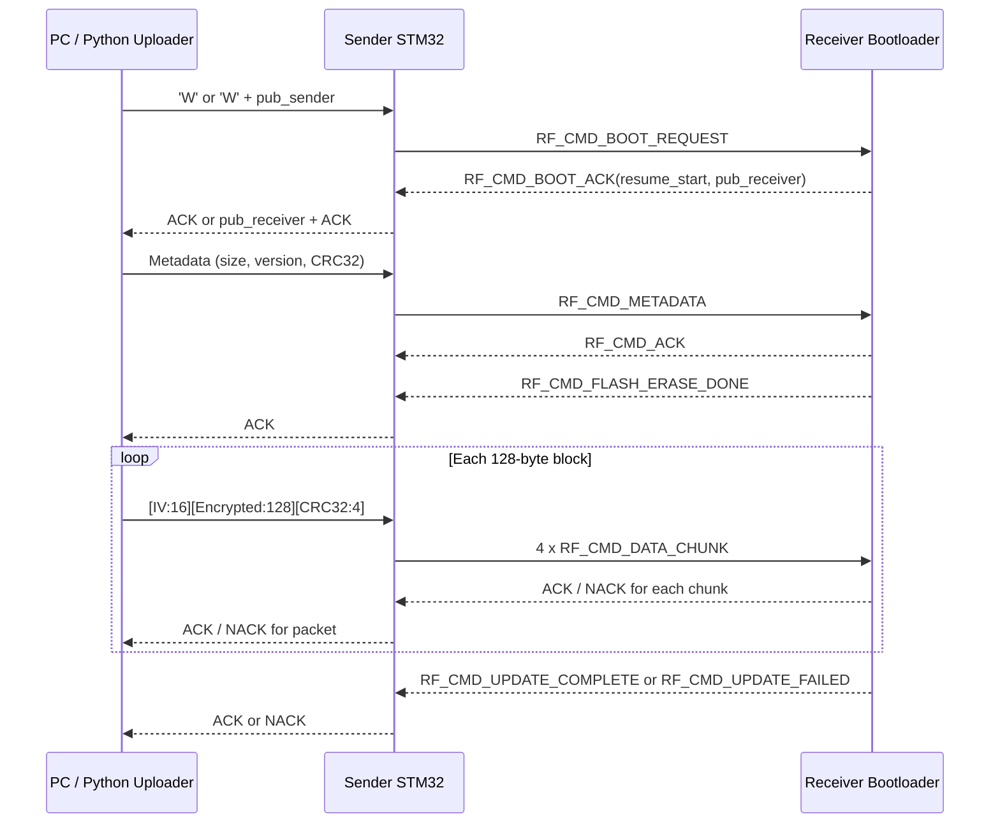

## Boot Kararı ve Kurtarma / Boot Decision and Recovery

**TR**

Receiver firmware sadece “bootloader” mantığı ile çalışmaz; aynı zamanda sistem açıldığında uygulamaya mı geçeceğine, kısa süreli RF dinlemesi yapıp yapmayacağına veya doğrudan update modunda mı kalacağına karar verir. Bu karar mekanizması sahadaki kullanım senaryosu için kritik önemdedir.

**EN**

The receiver does not blindly stay in bootloader mode. At startup it decides whether to jump to the application, open a short RF listening window, or stay in update mode. This decision logic is critical for real field operation.

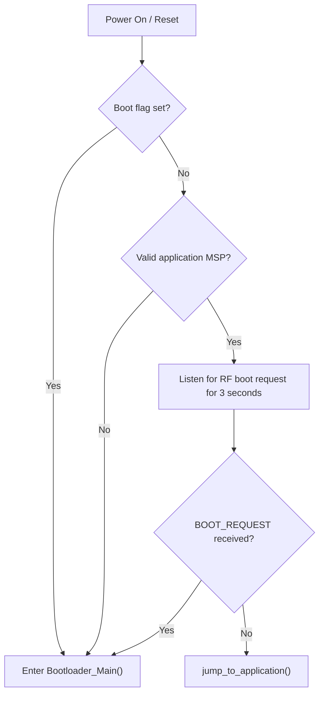

### Kısa yorum / Short interpretation

- **TR:** Boot flag varsa cihaz doğrudan bootloader’a gider.
  **EN:** If the boot flag is set, the device enters the bootloader immediately.
- **TR:** Geçerli uygulama varsa kısa RF bekleme penceresi açılır.
  **EN:** If a valid application exists, a short RF listening window is opened.
- **TR:** Update talebi gelmezse normal uygulama çalışır.
  **EN:** If no update request arrives, the normal application starts.
- **TR:** Geçerli uygulama yoksa cihaz güvenli şekilde bootloader’da kalır.
  **EN:** If no valid application is found, the device safely stays in bootloader mode.

## Flash Yerleşimi ve Resume Mekanizması / Flash Layout and Resume Mechanism

### Flash haritası / Flash map

| Bölge / Region | Başlangıç / Start | Bitiş / End | Boyut / Size | Açıklama / Description |
| --- | --- | --- | --- | --- |
| Bootloader | `0x08000000` | `0x08007FFF` | 32 KB | Receiver bootloader code |
| Application | `0x08008000` | `0x0803F7FF` | 222 KB | Updated application image |
| Boot Flag Page | `0x0803F800` | `0x0803FFFF` | 2 KB | Boot flag, version, resume metadata |
| Key Store | `0x08007800` | `0x08007FFF` page 15 | 2 KB page | Persistent AES master key page |

### Resume mantığı / Resume logic

**TR**

Resume sistemi, tüm firmware’i byte byte değil sayfa bazında takip eder. Uygulama alanındaki her 2 KB flash sayfası, 16 adet 128 byte firmware paketine karşılık gelir. Her sayfa tamamen yazıldığında boot flag sayfasındaki bitmap girişlerinden biri `0xFFFF` değerinden `0x0000` değerine çekilir. Sistem yeniden başlarsa bootloader bu bitmap’i okur, kaç sayfanın tamamlandığını hesaplar ve ilk eksik sayfaya denk gelen paketten devam edilmesini ister.

**EN**

The resume system tracks progress page by page rather than byte by byte. Each 2 KB application flash page corresponds to 16 firmware packets of 128 bytes. When a page is fully written, its bitmap entry in the boot-flag page is changed from `0xFFFF` to `0x0000`. After reboot, the bootloader reads this bitmap, determines how many pages are complete, and resumes from the first missing page.

### Resume meta alanı / Resume metadata area

| Offset | İçerik / Content |
| --- | --- |
| `+0` | `BOOT_FLAG_MAGIC` |
| `+4` | `BOOT_FLAG_REQUEST` |
| `+8` | Firmware version |
| `+12` | `RESUME_MAGIC` |
| `+16` | Total packet count |
| `+20` | Page completion bitmap |

## RF Protokolü / RF Protocol

### Paket boyutları / Packet sizes

| Tanım / Item | Değer / Value | Açıklama / Description |
| --- | --- | --- |
| RF header | 3 byte | `TYPE(1) + SEQ(2)` |
| Max RF payload | 50 byte | Si4432 FIFO sınırı nedeniyle |
| Full encrypted firmware packet | 148 byte | `IV(16) + Encrypted(128) + CRC32(4)` |
| Chunk data size | 48 byte | 148 byte veri 4 parçaya ayrılır |
| Chunks per firmware packet | 4 | `48 + 48 + 48 + 4` |

### Komut tipleri / Command types

| Komut / Command | Hex | Yön / Direction | Açıklama / Description |
| --- | --- | --- | --- |
| `RF_CMD_BOOT_REQUEST` | `0x01` | Sender -> Receiver | Receiver’ı bootloader moduna çağırır |
| `RF_CMD_BOOT_ACK` | `0x02` | Receiver -> Sender | Receiver hazır, resume bilgisi içerir |
| `RF_CMD_METADATA` | `0x03` | Sender -> Receiver | Boyut, versiyon, CRC bilgisi |
| `RF_CMD_DATA_CHUNK` | `0x04` | Sender -> Receiver | Firmware veri parçası |
| `RF_CMD_FLASH_ERASE_DONE` | `0x05` | Receiver -> Sender | Veri kabulüne hazır |
| `RF_CMD_UPDATE_COMPLETE` | `0x06` | Receiver -> Sender | Güncelleme başarılı |
| `RF_CMD_UPDATE_FAILED` | `0x07` | Receiver -> Sender | Güncelleme başarısız |
| `RF_CMD_KEY_UPDATE` | `0x08` | Sender -> Receiver | Yeni master key aktarımı |
| `RF_CMD_KEY_UPDATE_ACK` | `0x09` | Receiver -> Sender | Key başarıyla kaydedildi |
| `RF_CMD_ACK` | `0x10` | Both | Genel onay |
| `RF_CMD_NACK` | `0x11` | Both | Genel ret |

### Metadata formatı / Metadata format

```text
[firmware_size:4][firmware_version:4][firmware_crc32:4]
```

### Chunk payload formatı / Chunk payload format

```text
[chunk_index:1][chunk_total:1][data:0..48]
```

## Güvenlik Modeli / Security Model

### 1. Firmware şifreleme / Firmware encryption

- **TR:** Her 128 byte firmware bloğu AES-256-CBC ile şifrelenir.
  **EN:** Every 128-byte firmware block is encrypted with AES-256-CBC.
- **TR:** Her blok için rastgele IV üretilir.
  **EN:** A random IV is generated for each block.
- **TR:** Şifrelenmiş blok ayrıca CRC-32 ile korunur.
  **EN:** The encrypted block is additionally protected by CRC-32.

### 2. ECDH tabanlı oturum anahtarı / ECDH-based session key

- **TR:** `rf_uploader.py`, X25519 ile ephemeral anahtar çifti oluşturur.
  **EN:** `rf_uploader.py` creates an ephemeral X25519 key pair.
- **TR:** Gönderici ve alıcı ortak bir shared secret türetir.
  **EN:** The sender and receiver derive a shared secret.
- **TR:** Bu shared secret doğrudan AES session key olarak kullanılabilir.
  **EN:** That shared secret can be used directly as the AES session key.

### 3. Kalıcı master key / Persistent master key

- **TR:** Receiver tarafında flash üzerinde bir `KEY_STORE` alanı bulunur.
  **EN:** The receiver stores a persistent `KEY_STORE` in flash.
- **TR:** Yeni master key, session key ile şifrelenerek uzaktan güncellenebilir.
  **EN:** A new master key can be updated remotely after being encrypted with the session key.

### 4. GUI konfigürasyon güvenliği / GUI configuration security

- **TR:** `credentials.enc`, admin kullanıcı bilgilerini ayrı ve şifreli biçimde tutar.
  **EN:** `credentials.enc` stores admin credentials separately and in encrypted form.
- **TR:** `config.enc`, cihaz listesi ve ayarları admin parolasıyla türetilen anahtarla şifreler.
  **EN:** `config.enc` encrypts device profiles and settings using a key derived from the admin password.

### 5. Proxy tabanlı firmware erişimi / Proxy-based firmware access

- **TR:** GUI tarafı artık Drive klasör veya dosya kimliklerini doğrudan bilmek zorunda değildir.
  **EN:** The GUI no longer needs to know Drive folder or file identifiers directly.
- **TR:** Cihaz profilleri yalnızca kanal adı taşır; gerçek Drive klasör eşlemesi proxy server tarafındaki `proxy_channels.json` içinde tutulur.
  **EN:** Device profiles carry only the channel name; the real Drive folder mapping is stored server-side in `proxy_channels.json`.
- **TR:** Proxy, katalog çağrısında kısa ömürlü indirme token'i üretir ve istemciye yalnızca bu token'i döner.
  **EN:** The proxy generates a short-lived download token during catalog lookup and returns only that token to the client.

### 6. Önemli pratik not / Important practical note

**TR:** Repoda iki PC tarafı upload yolu vardır. `gui_uploader_qt.py` tarafı kullanıcı dostu wizard deneyimi verir ve `uploder.py` üzerinden çalışır. `rf_uploader.py` ise ECDH ve opsiyonel key update gibi gelişmiş RF akışını ayrı bir CLI aracı olarak sağlar.

**EN:** The repository currently contains two PC-side upload paths. `gui_uploader_qt.py` provides the user-friendly wizard experience and uses `uploder.py`, while `rf_uploader.py` provides the advanced RF CLI flow including ECDH and optional key update.

## Koddan Örnekler / Code Examples

### Örnek 1: Receiver boot kararı / Example 1: Receiver boot decision

```c
if (check_boot_flag()) {
  Bootloader_Main();
  NVIC_SystemReset();
}

uint32_t app_msp = *(volatile uint32_t *)APP_ADDRESS;
if ((app_msp & 0xFFF00000) == 0x20000000) {
  if (RF_WaitForPacket(&rx_type, &rx_seq, rx_pld, &rx_pld_len, 3000)) {
    if (rx_type == RF_CMD_BOOT_REQUEST) {
      Bootloader_Main();
      NVIC_SystemReset();
    }
  }
  jump_to_application();
}

Bootloader_Main();
NVIC_SystemReset();
```

- **TR:** Bu parça, sistemin koşullara göre uygulamaya geçmesini veya bootloader’da kalmasını sağlar.
- **EN:** This block lets the system either jump to the application or remain in bootloader mode depending on runtime conditions.

### Örnek 2: Gateway tarafında chunk bazlı güvenilir iletim / Example 2: Reliable chunk transmission on the gateway

```c
for (uint8_t chunk = 0; chunk < RF_CHUNKS_PER_PACKET; chunk++) {
  chunk_payload[0] = chunk;
  chunk_payload[1] = RF_CHUNKS_PER_PACKET;
  memcpy(&chunk_payload[2], &fw_packet_buf[data_offset], data_len);

  uint16_t chunk_seq = rf_seq_counter++;

  if (!RF_SendChunkReliable(RF_CMD_DATA_CHUNK, chunk_seq, chunk_payload,
                            data_len + 2)) {
    all_chunks_ok = 0;
    break;
  }
}
```

- **TR:** 148 byte’lık bir paket doğrudan RF’e atılmıyor; küçük parçalara bölünüp tek tek onaylanıyor.
- **EN:** A 148-byte packet is not sent as-is over RF; it is split into smaller pieces and acknowledged one by one.

### Örnek 3: Receiver tarafında sayfa tamamlanınca resume kaydı / Example 3: Resume bookkeeping after each completed page

```c
current_addr += FW_PACKET_SIZE;
packets_received++;

if (packets_received % PACKETS_PER_PAGE == 0) {
  uint32_t page_done = (packets_received / PACKETS_PER_PAGE) - 1;
  Resume_SavePageDone(page_done);
}
```

- **TR:** Bu mekanizma sayesinde enerji kesilirse veya bağlantı koparsa tüm transfer baştan başlamaz.
- **EN:** Thanks to this mechanism, a power loss or link interruption does not force the entire transfer to restart.

### Örnek 4: Python tarafında ECDH session key üretimi / Example 4: ECDH session key creation on the Python side

```python
private_key = X25519PrivateKey.generate()
pub_sender_bytes = private_key.public_key().public_bytes_raw()
ser.write(b'W' + pub_sender_bytes)

response = ser.read(33)
pub_receiver_bytes = response[:32]
pub_receiver_key = X25519PublicKey.from_public_bytes(pub_receiver_bytes)
session_key = private_key.exchange(pub_receiver_key)
```

- **TR:** Havada sabit anahtar dolaştırmak yerine oturum için geçici bir shared secret türetilir.
- **EN:** Instead of exposing a fixed key over the air, a temporary shared secret is derived for the session.

### Örnek 5: GUI konfigürasyonunun şifrelenmesi / Example 5: GUI configuration encryption

```python
salt = get_random_bytes(SALT_SIZE)
key = _derive_key(admin_password, salt)
iv = get_random_bytes(IV_SIZE)
plaintext = json.dumps(config, ensure_ascii=False).encode('utf-8')
cipher = CryptoAES.new(key, CryptoAES.MODE_CBC, iv)
ciphertext = cipher.encrypt(pad(plaintext, CryptoAES.block_size))
```

- **TR:** Masaüstü arayüz yalnızca firmware göndermiyor; aynı zamanda cihaz profillerini de şifreli saklıyor.
- **EN:** The desktop application does more than upload firmware; it also stores device profiles in encrypted form.

## Arayüz Akışı / UI Walkthrough

### Ana wizard / Main wizard

**TR**

Masaüstü arayüz üç aşamalı bir wizard mantığıyla tasarlanmıştır:

1. **Bağlantı modu seçimi:** Seri port veya RF modu seçilir.
2. **Donanım konfigürasyonu:** Cihaz profili, COM port ve ilgili bağlantı ayarları doğrulanır.
3. **Firmware güncelleme:** Firmware sürümü seçili kanalın proxy kataloğundan alınır, progress bar ve log alanı ile süreç izlenir.

**EN**

The desktop UI is designed as a three-step wizard:

1. **Connection mode selection:** Serial or RF mode is chosen.
2. **Hardware configuration:** The device profile, COM port, and related communication settings are verified.
3. **Firmware update:** The firmware version is selected from the proxy catalog of the chosen channel, and the process is tracked through a progress bar and log area.

### Admin panel / Admin panel

**TR**

Admin paneli üç ana sekme içerir:

- **Cihazlar:** Cihaz listesi, seçili cihaz özeti, AES anahtarı görüntüleme/gizleme, STM32 key güncelleme
- **Ayarlar:** Baud rate, retry, packet size, varsayılan port, backend `URL|API_KEY`
- **Güvenlik:** Şifre değiştirme ve config sıfırlama

**EN**

The admin panel contains three main tabs:

- **Devices:** device list, selected-device summary, AES key show/hide, STM32 key update
- **Settings:** baud rate, retry count, packet size, default port, backend `URL|API_KEY`
- **Security:** password change and configuration reset

### Arayüzde dikkat çeken noktalar / Notable UI details

- **TR:** `main_window.ui` içinde 3 adımlı `QStackedWidget` wizard yapısı vardır.
  **EN:** `main_window.ui` contains a 3-step `QStackedWidget` wizard.
- **TR:** `admin_window.ui` ayrı bir admin kontrol merkezi olarak tasarlanmıştır.
  **EN:** `admin_window.ui` is designed as a separate admin control center.
- **TR:** Firmware sürümleri proxy kataloğuna dönen dosya adlarından `update 2.bin`, `update_3.hex`, `update-5.bin` gibi desenlerle okunabilir.
  **EN:** Firmware versions can be parsed from the filenames returned by the proxy catalog, such as `update 2.bin`, `update_3.hex`, or `update-5.bin`.

## Ekran Görüntüsü Yer Tutucuları / Screenshot Placeholders

> **TR:** Aşağıdaki görseller özellikle boş yer tutucu olarak eklendi. Bunları kendi ekran görüntülerinizle değiştirmek için aynı dosya adlarını koruyarak üzerine yazmanız yeterlidir.
>
> **EN:** The images below are intentionally added as placeholders. To replace them with real screenshots, simply overwrite the files while keeping the same file names.

### 1. Genel açılış görünümü / General opening overview

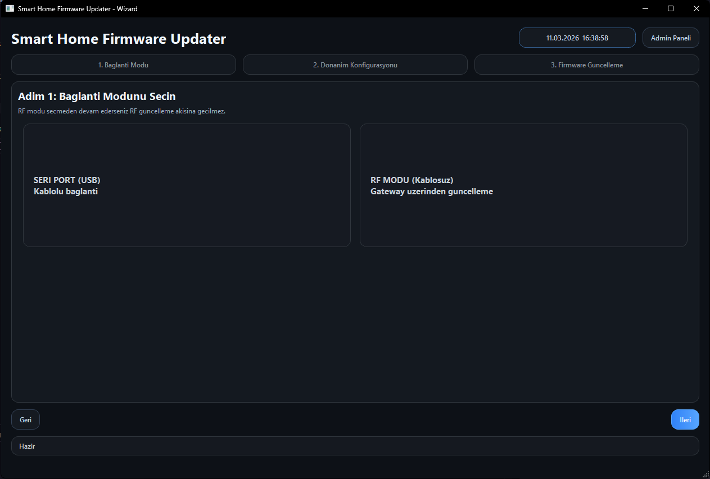

### 2. Adım 1: Bağlantı modu seçimi / Step 1: Connection mode selection

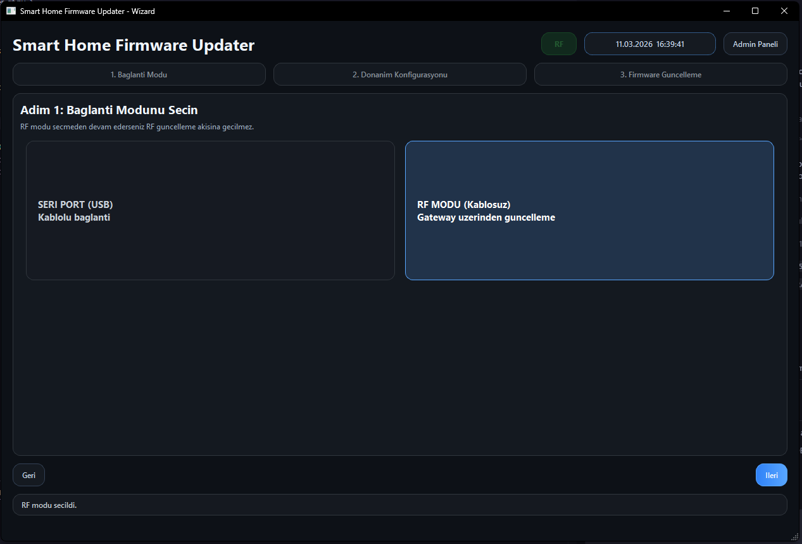

### 3. Adım 2: Cihaz ve port ayarları / Step 2: Device and port settings

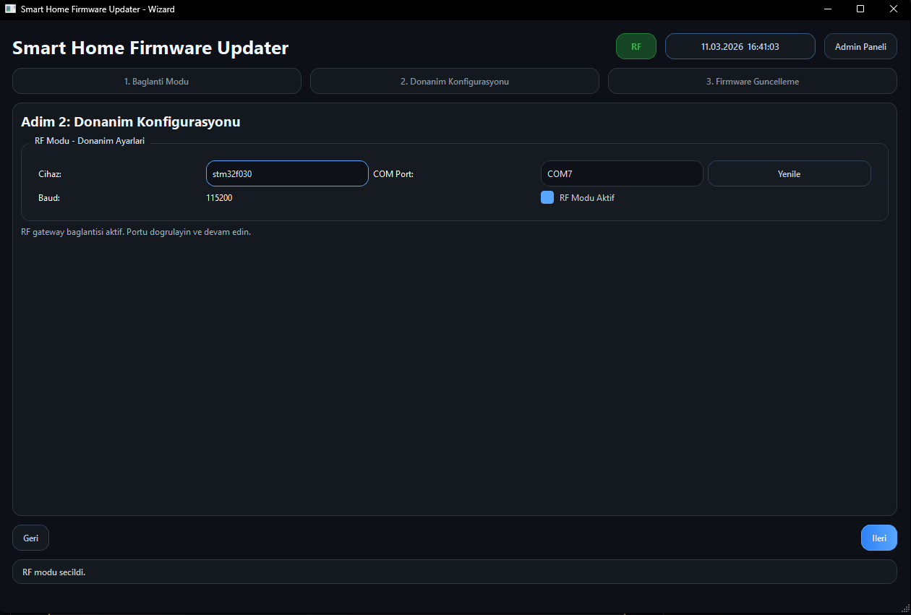

### 4. Adım 3: Firmware listesi ve sürüm seçimi / Step 3: Firmware list and version selection

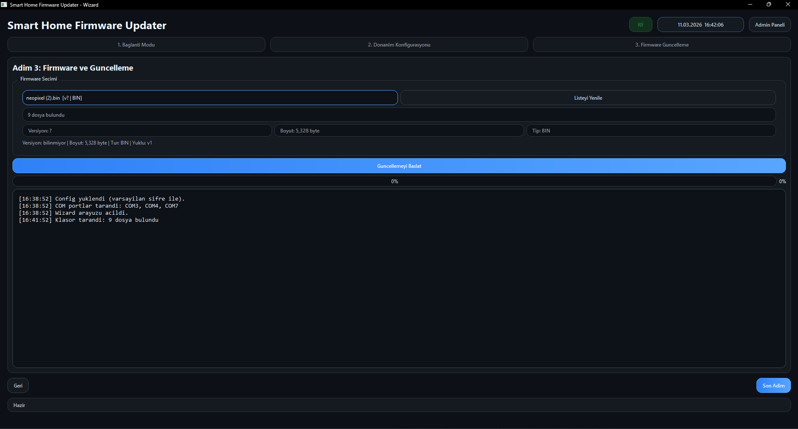

### 5. Güncelleme sırasında ilerleme ekranı / Upload progress screen

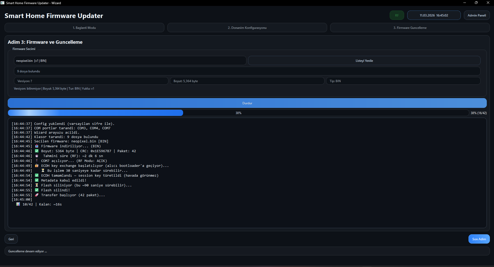

### 6. Başarılı güncelleme sonucu / Successful update result

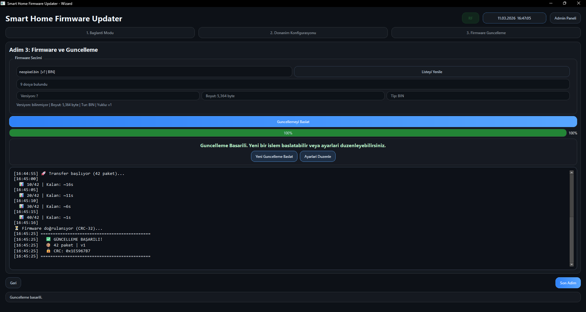

### 7. Admin paneli: cihaz yönetimi / Admin panel: device management

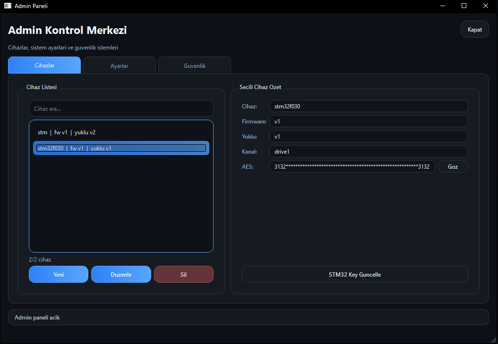

### 8. Admin paneli: ayarlar ve güvenlik / Admin panel: settings and security

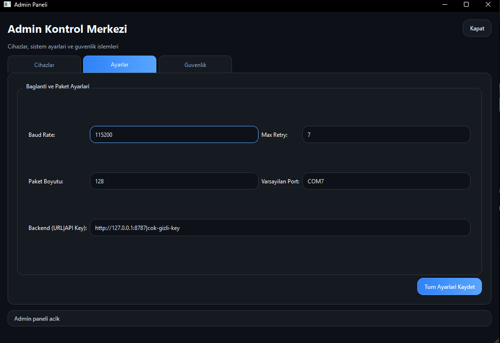

## Kurulum ve Çalıştırma / Setup and Run

### Gereksinimler / Prerequisites

- **TR:** STM32CubeIDE veya STM32CubeMX tabanlı geliştirme ortamı
  **EN:** STM32CubeIDE or an STM32CubeMX-based development environment
- **TR:** Python 3.x
  **EN:** Python 3.x
- **TR:** Windows seri port erişimi
  **EN:** Windows serial-port access
- **TR:** GUI için proxy backend erişimi (`http://host:port|api_key`)
  **EN:** Proxy backend access for the GUI (`http://host:port|api_key`)
- **TR:** Proxy server için Google Drive Service Account JSON
  **EN:** Google Drive service-account JSON for the proxy server

### Python masaüstü aracı / Python desktop tool

```powershell
cd Uploader
pip install -r requirements.txt
python gui_uploader_qt.py
```

### Firmware proxy server / Firmware proxy server

```powershell
cd Uploader

$env:FIRMWARE_PROXY_API_KEY = "cok-gizli-key"
$env:FIRMWARE_PROXY_SA_JSON = "C:\path\to\service_account.json"
$env:FIRMWARE_PROXY_CHANNEL_MAP_FILE = "$PWD\proxy_channels.json"

python firmware_proxy_server.py --host 127.0.0.1 --port 8787
```

`proxy_channels.json` örneği / `proxy_channels.json` example:

```json
{
  "urun-a-seri-1": {
    "folder_id": "GOOGLE_DRIVE_FOLDER_ID_A"
  },
  "urun-b-seri-2": {
    "folder_id": "GOOGLE_DRIVE_FOLDER_ID_B"
  }
}
```

GUI admin panel backend alanına şu format girilir / Enter the following format into the GUI admin backend field:

```text
http://127.0.0.1:8787|cok-gizli-key
```

### PyInstaller ile EXE üretimi / Building an EXE with PyInstaller

```powershell
cd Uploader
build_exe.bat
```

### Gelişmiş RF CLI uploader / Advanced RF CLI uploader

```powershell
cd Uploader
python rf_uploader.py path\to\firmware.bin --port COM7 --version 5 --type BIN
```

Opsiyonel master key güncelleme / Optional master-key update:

```powershell
cd Uploader
python rf_uploader.py path\to\firmware.bin --port COM7 --version 5 --new-master-key 00112233445566778899AABBCCDDEEFF00112233445566778899AABBCCDDEEFF
```

### STM32 firmware projeleri / STM32 firmware projects

**TR**

Her iki gömülü proje de STM32CubeIDE/CubeMX yapısı ile tutulur. İlgili `.ioc` dosyaları açılarak pin yapıları, clock ve peripheral konfigürasyonu incelenebilir:

- `uart_rf_gonderici/uart_rf_gonderici.ioc`
- `alici_cihaz/alıcı_cihaz.ioc`

**EN**

Both embedded projects are organized as STM32CubeIDE/CubeMX projects. The corresponding `.ioc` files can be opened to inspect pinout, clock, and peripheral configuration:

- `uart_rf_gonderici/uart_rf_gonderici.ioc`
- `alici_cihaz/alıcı_cihaz.ioc`


## Ek Notlar / Additional Notes

### LED durumları / LED states

Receiver bootloader NeoPixel renkleri:

| Renk / Color | Anlam / Meaning |
| --- | --- |
| Turuncu / Orange | Bootloader aktif, gönderici bekleniyor |
| Kırmızı / Red | Hata durumu |
| Yeşil / Green | Güncelleme başarılı |
| Mavi / Blue | Transfer sırasında çift paket |
| Mor / Purple | Transfer sırasında tek paket |

### Varsayılan admin hesabı / Default admin account

- **TR:** Kodda varsayılan admin bilgisi `admin / admin` olarak tanımlı. Gerçek kullanımda ilk iş bunun değiştirilmesi gerekir.
- **EN:** The code defines the default admin credentials as `admin / admin`. In any real deployment, this should be changed immediately.


